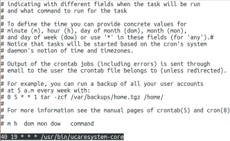
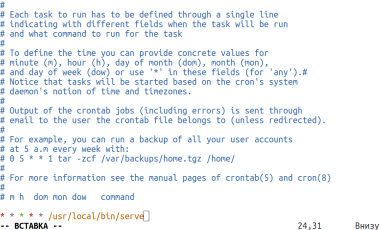
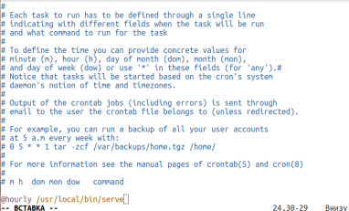

## Использование планировщика заданий **CRON**

CRON - это программа-демон. Её основная задача выполнять указанные пользователем процессы в указанное пользователем время, например с определённой периодичностью.

Давайте рассмотрим синтаксис настройки одной задачи cron: \
`минута час день месяц день_недели /путь/к/исполняемому/файлу`

Нужно сказать, что обязательно нужно писать полный путь к команде, потому что для команд, запускаемых от имени cron переменная среды PATH будет отличаться. Дата и время указываются с помощью цифр или символа '*'. Этот символ означает, что процесс нужно выполнять каждый раз.

Примеры настройки cron:
- Сначала можно посмотреть задачи cron для суперпользователя, для этого можно воспользоваться командой `crontab -l`: \
  
- Вы можете удалить все существующие задачи командой -r
- Самый простой пример -- запускать какой-нибудь процесс каждую минуту командой `* * * * * /usr/local/bin/serve`: \
  
- Вы можете выбрать любую минуту, час и день недели, например, 15.30 во вторник: `30 15 * * 2 /usr/local/bin/serve`
- Кроме того, для некоторых часто используемых наборов были придуманы специальные переменные, вот они:
    - @reboot -- при загрузке, только один раз
    - @yearly, @annually -- раз год
    - @monthly -- раз в месяц
    - @weekly -- раз в неделю
    - @daily, @midnight -- каждый день
    - @hourly -- каждый час

    - Например, запуск скрипта раз в час командой `@hourly /usr/local/bin/serve`: \
      
