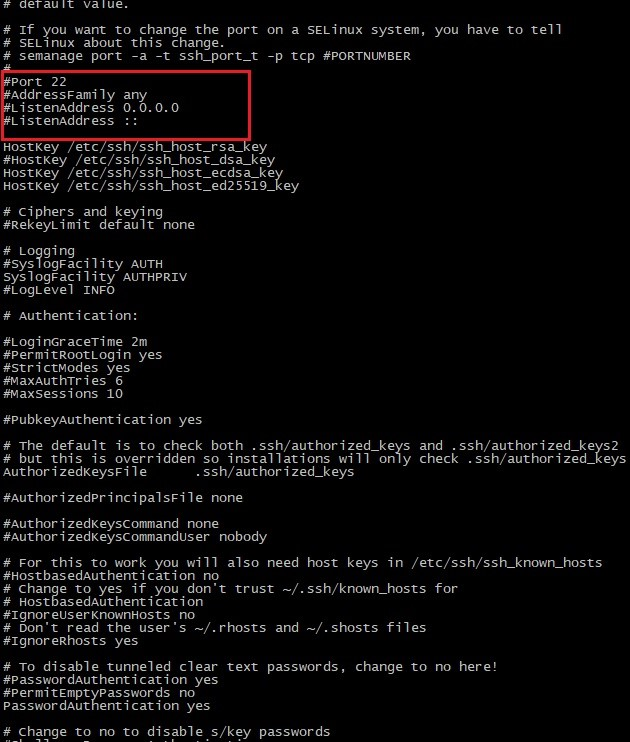

## Установка и базовая настройка сервиса **SSHD**
SSH или Secure Shell - это сетевой протокол безопасного доступа из одного компьютера к другому по сети. \
SSHd — это служба, принимающая запросы на соединения от клиентов, т.е. других компьютеров. \
Настройка сервера SSH производится путём настройки программы-демона SSHd. \
Программа-демон - это программа, запускаемая самой системой и работающая в фоновом режиме.

Теперь разберёмся зачем и что обычно настраивают в службе SSH. \
Режим работы SSH-сервера с настройками по-умолчанию хоть и является вполне работоспособным для небольших частных сетей, всё же нуждается в задании некоторых важных параметров для использования на высоконадёжных публичных серверах. \
Настройки демона хранятся в файле /etc/ssh/sshd_config.

В первую очередь следует обратить внимание на следующие параметры: Port, AddressFamily, ListenAddress. \
Первый глобально задаёт номер порта, через который будет работать соединение и если оставить его стандартным, т.е. 22, то велика вероятность, что он будет слишком часто сканироваться роботами.

 \
*Примечание:* для задания активации параметра необходимо раскомментировать соответствующую строку — убрать символ «#» в её начале.

Второй параметр задаёт семейство используемых IP-адресов — IPv4 и IPv6.
Если, к примеру, используются только адреса IPv4 или только IPv6, то, для оптимизации работы, очень рекомендуется установить особое значение для параметра AddressFamily.

Параметр ListenAddress позволяет задавать порты для отдельных сетевых интерфейсов. \
Поскольку реализация openSSH позволяет работать с протоколами SSH1 и SSH2, то разумно отключить использование SSH1, т. к. эта версия является устаревшей. \
Очень полезным является параметр, позволяющий проводить авторизацию и шифрование трафика с помощью специальных SSH-ключей. \
Иногда, когда следует задавать мультисерверную конфигурацию, очень удобно использовать алиасы (Aliases), что позволяет настроить сразу несколько режимов доступа (с разными хостами, портами и т.д.) и использовать их, указывая при этом конкретный алиас.

Для применения сделанных настроек необходим перезапуск SSH-сервера.

И ещё немного про то, как, собственно, пользоваться SSH. Для подключения к серверу используется команда: \
`ssh user_name@host_name`, \
где user_name – имя пользователя в системе, host_name – имя узла, к которому производится подключение.

При этом утилита ssh запросит (в зависимости от настроек сервера) логин, пароль или парольную фразу для разблокировки приватного ключа пользователя.

Утилита ssh позволяет сразу выполнить нужную команду без открытия терминала удаленной машины. Например, команда: \
`ssh user@host ls` \
выполнит команду ls на удаленном сервере и вернет ее вывод в текущий терминал.

Кроме выполнения команд, можно копировать файлы по ssh. Для этого используется утилита scp. Просто укажите файл, который нужно передать, удаленный сервер и папку на сервере, например: \
`scp ~/test.txt user@host:documents`

