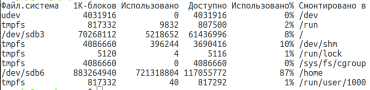
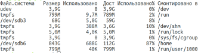
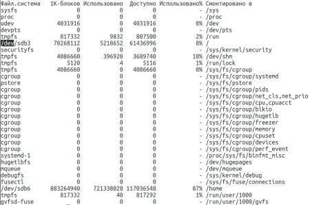

## Using the **df** utility
df is a command to get a detailed report on the system's disk space usage.

Here are some examples of how to use the df command:
- A simple call to the df command: \
  
- Now let's ask the utility to output data in a more readable format using the -h option: \
  
- If you pass the -a option, you can get information about all file systems known to the kernel which have been mounted: \
  
- -H -- option to output all sizes in gigabytes
- -P -- option to use POSIX output format
- -x -- option to output information about all sizes but specified file systems
