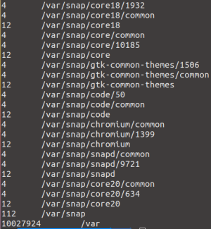
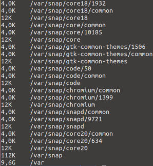
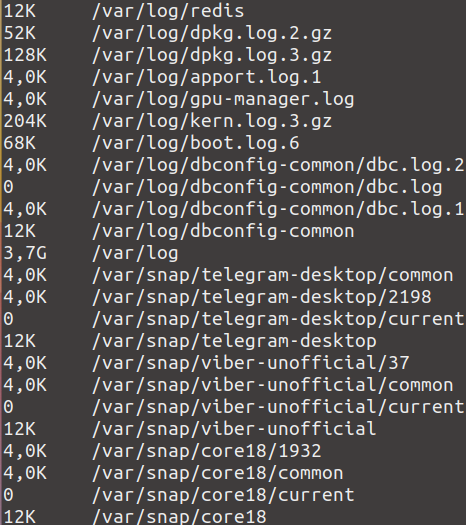

## Использование утилиты **du**
du - это команда для получения приблизительного объема дискового пространства, используемого указанными при вызове команды файлами или каталогами.

Вот несколько примеров работы с командой du:
- Чтобы просто вывести список папок в определённом каталоге и занимаемое ими место, например, в /var выполните: \
  
- По умолчанию размер выводится в байтах. Для того чтобы размер выводился в более читабельном виде используйте опцию -h: \
  
- Если надо выводить размер не только папок, но и файлов, которые там находятся, используйте опцию -a: \
  
- -c -- ключ вывода в конце общего размера всех папок
- -d -- максимальная глубина вложенности директорий
- -s -- ключ вывода только общего размера
