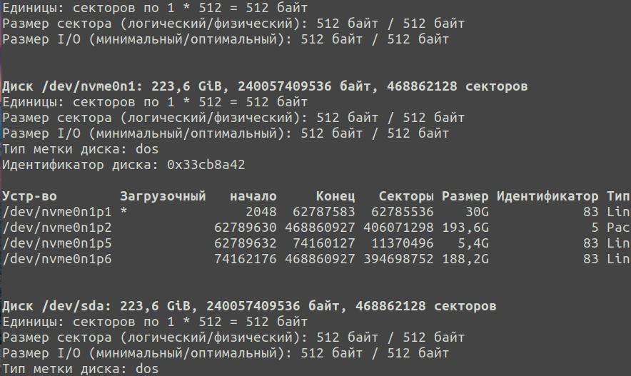
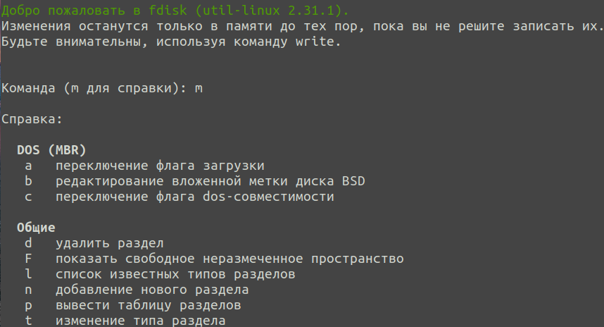
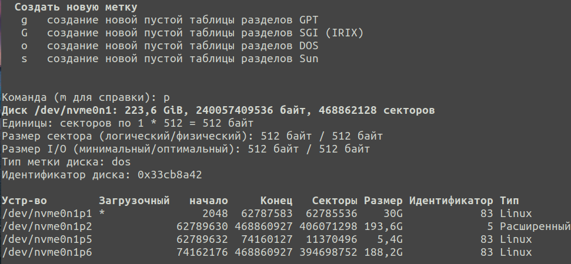

## Using the **fdisk** utility
Because hard disks have a high capacity, their space is usually divided into several parts - disk partitions, and you can work with them as if they were independent disks in the system. \
fdisk is a command to manage hard disk partitions and also to get information about them.

Here are some examples of how to use the fdisk command:
- To see a list of disks and partitions available to you, use the -l option: \
  
- Most fdisk partitioning operations are performed interactively. To run fdisk in interactive mode, pass the block device you want to partition to the utility.
  In this example it’s - /dev/nvme0n1: \
  
- To see the current partition table type as well as the available partitions on the disk, use the p command: \
  
- m -- command to turn off or switch the memory information display mode
- w -- command to write a new partition table to the drive (basically save the changes)
- q -- command to exit without saving
