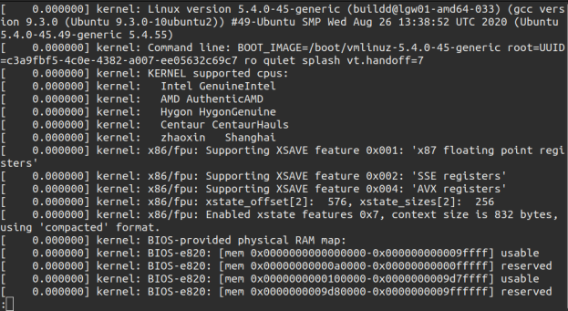
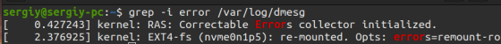

## Working with system logs
System logs are files that store all the events and processes that happen to files, devices, etc. \
There are many system logs and they are all located in the /var/log/ directory. \

There are several Linux command line utilities that are easy to use to see the logs. Here are the commands most commonly used for this purpose:
- less
- more
- cat
- head
- grep
- tail
- zcat
- zgrep
- zmore
- vi
- nano

Let's look at some of them using the /var/log/dmesg log as an example:
- less -- a scrollable log viewer: \
  
- tail -- view logs in real time
- cat -- open a log file
- head -- view first lines of logs
- grep -i error -- display only errors from log file: \
  
