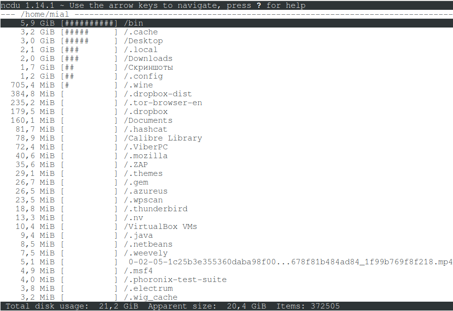
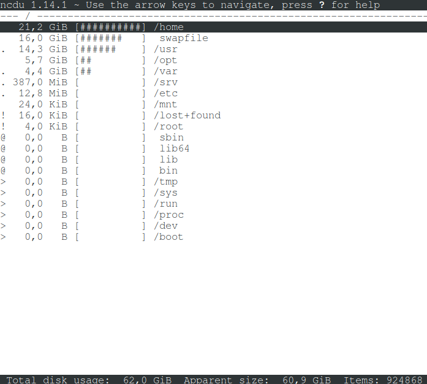

## Установка и использование утилиты **ncdu**
ncdu - это команда, имеющая то же назначение, что и du, но обладающая приятным и удобным интерфейсом.

Вот несколько примеров работы с командой ncdu:
- Использование программы элементарное. Для сканирования и обзора текущей директории, в которой вы находитесь, просто запустите программу ncdu: \
  
- Чтобы просканировать всю файловую систему, нужно указать путь. Для корня это слэш. Также пригодиться опция -x — не выходить за пределы текущей файловой системы. Дело в том, что к корневой файловой системе могут быть смонтированы другие диски — и без этой опцией они также будут посчитаны. Выполнение команды `ncdu -x /`:\
  
- Для перехода в выбранную директорию используйте одну из следующих кнопок:
    - курсор вправо
    - ENTER
    - l
- Для возврата в родительскую директорию используйте одну из следующих кнопок:
    - курсор влево
    - <
    - h
- Для сортировки директорий и файлов используются следующие кнопки (нажмите ещё раз для обратного порядка):
    - n — по имени файла
    - s — по размеру файла
    - C — по количеству элементов
    - M — по времени модификации последнего дочернего элемента
