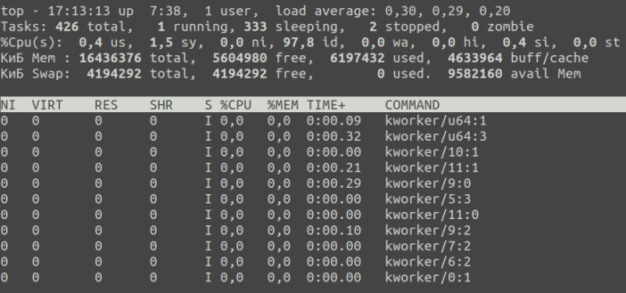
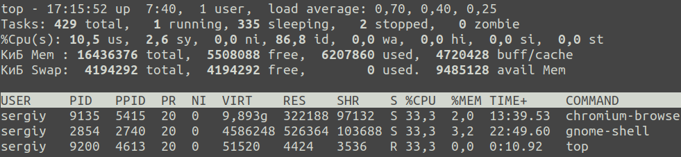
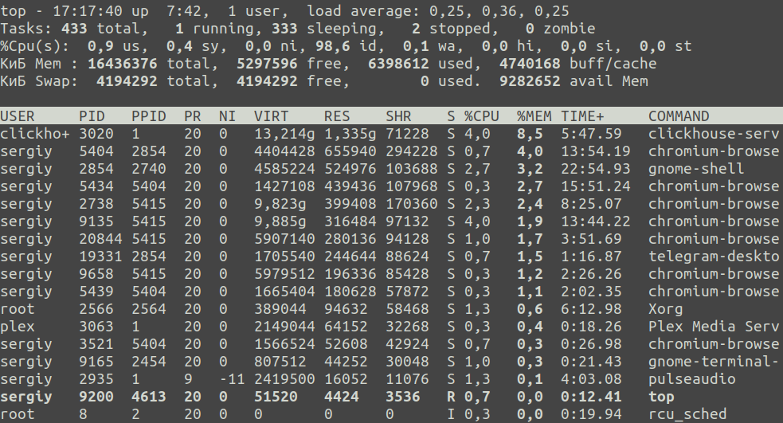
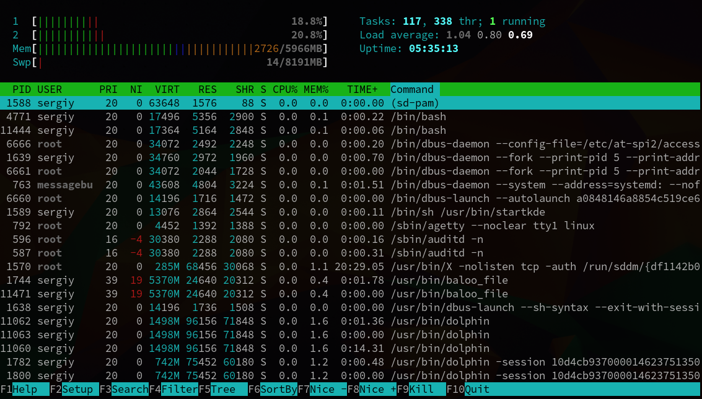
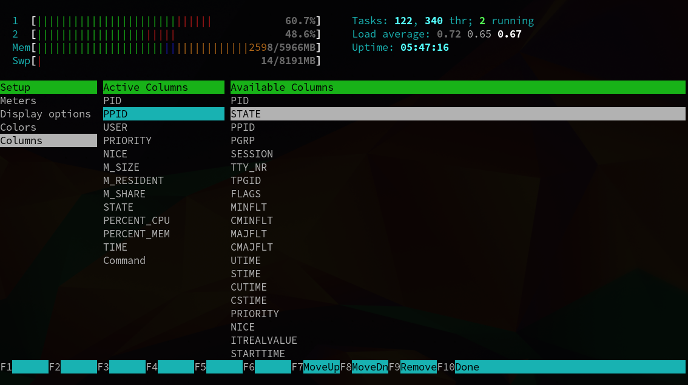
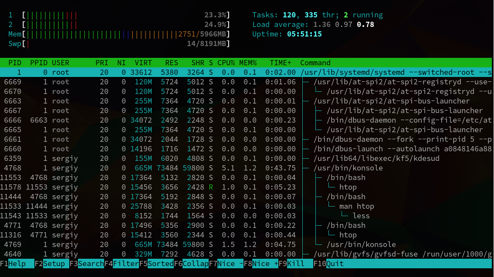

## The top command
The top command shows Linux running programs and services, system resource consumption data, and allows you to search, stop, and manage processes.

Here are some examples of working with the top command:
- You can roughly divide the window into two parts. The top part contains information about the system, overall CPU and memory usage, the swap partition, and so on. In the lower part of the window is a list of running processes with information sorted by a certain field. \
  
- If you only want to display processes that use CPU resources, use the i command: \
  
- To highlight the field currently being sorted, press x. The entire column will then be highlighted in bold: \
  
- m -- command to turn off or switch the memory information display mode
- F -- command to set the process information fields
- L -- word search command

## The htop command
The htop command performs more or less the same task as **top**, but has certain advantages and disadvantages: more convenient searching and filtering, but less flexible configuration of the process display.

Here are some examples of how to use the htop command:
- When you open htop, you will instantly see a list of running processes. Of course, not all Linux processes are shown there. By default, only processes running under your user are shown: \
  
- You can add more options to the display using the Setup menu. It's very simple there, read the tooltips and follow the instructions. For example, we added the PPID parameter: \
  
- There's also an interesting option to place processes in a tree view. You'll be able to see which process was started by which. Press F5 to display the tree: \
  
