## Part 1. Установка ОС

- ``Смотрим версию Ubuntu после установки `` 
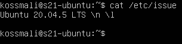 

---

## Part 2. Создание пользователя
- ``Создаём пользователя и назначаем ему группу adm`` 
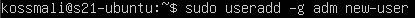 

- ``Вывод списка пользователей (новый юзер в конце списка)`` 
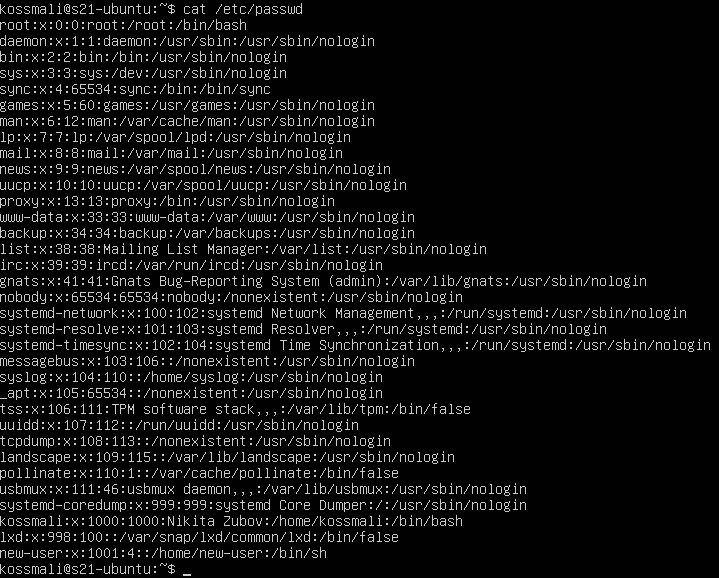 

---

## Part 3. Настройка сети ОС

- ``Установили новое имя машины и вывели его в терминал`` 
 

- ``Установили новую временную зону и вывели информацию в терминал`` 
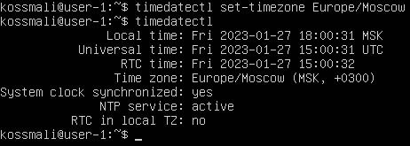 

- ``Установили набор сетевых инструментов`` 
 
``Вывели информацию о сетевых интерфейсах`` 
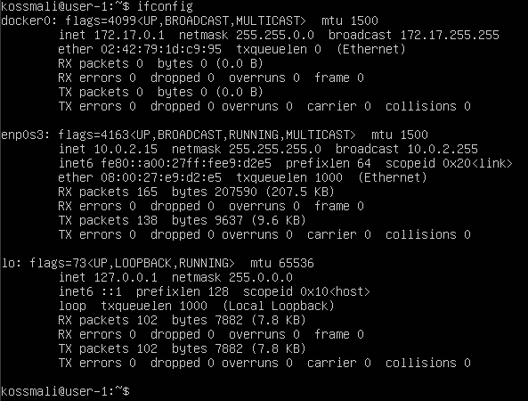 
**lo (loopback device)** – виртуальный интерфейс, присутствующий по умолчанию в любом Linux. Он используется для отладки сетевых программ и запуска серверных приложений на локальной машине. С этим интерфейсом всегда связан адрес 127.0.0.1. У него есть dns-имя – localhost.

- ``Удалили старый и получили новый ip от dhcp сервера`` 
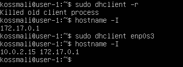 
**DHCP - Dynamic Host Configuration Protocol**

- ``Узнали внешний IP-адрес`` 
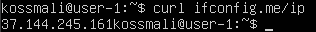 

- ``Узнали внутренний IP-адрес шлюза, он же ip-адрес по умолчанию`` 
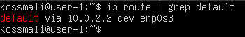 

- ``Изменили файл /etc/netplan/*.yaml, применили изменения в netplan, перезагрузились`` 
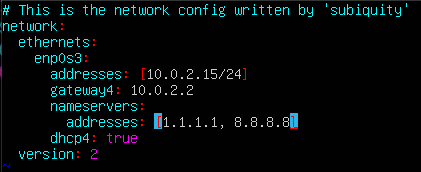 
 
- ``Проверяем, что адреса соотсветствуют заданным в предыдущем пункте`` 
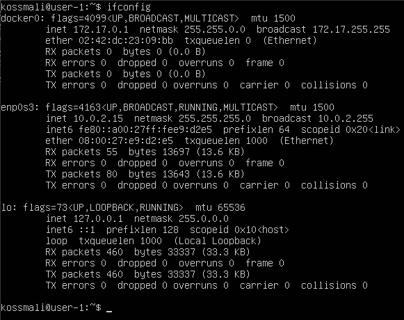 
- ``Успешно пропинговали удаленные хосты 1.1.1.1 и ya.ru`` 
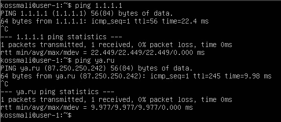 

---

## Part 4. Обновление ОС
- ``Успешно обновили системыне пакеты`` 
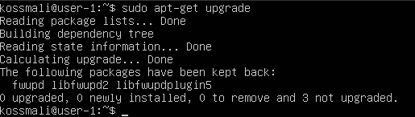 

---

## Part 5. Использование команды sudo
- **sudo** - позволяет временно поднимать привилегии и выполнять задачи администрирования системы с максимальными правами 
``Добавили пользователя в группу с привилегиями sudo, переключились на этого пользователя и поменяли hostname`` 
 
